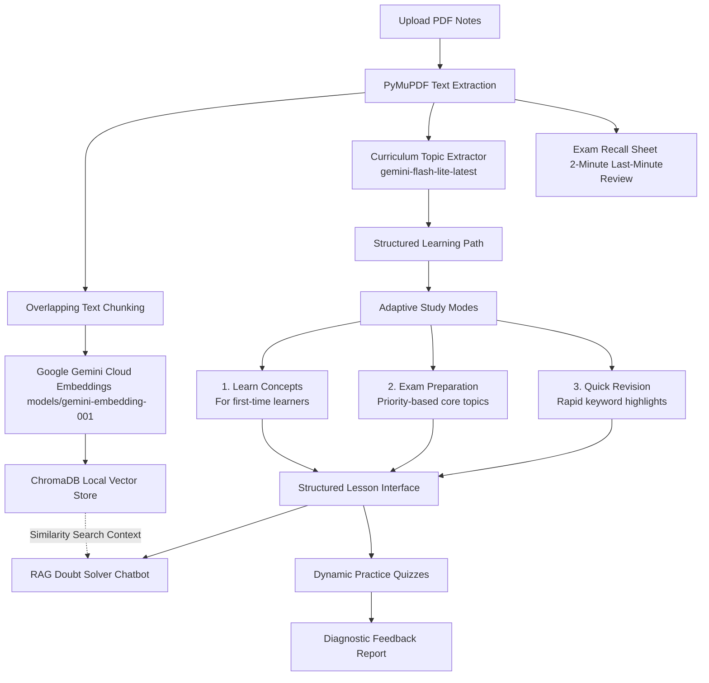

# StudyFlow AI — Adaptive Study Assistant & Smart Tutor

StudyFlow AI is an interactive, AI-powered study assistant built on the Google Gemini ecosystem. It transforms passive reading of lecture notes (PDF format) into an active, structured learning experience. By automatically extracting curriculum topics, hosting a contextual doubt-solving chat, generating custom-tailored lessons, administering dynamic assessments, and preparing last-minute memory recall sheets, StudyFlow AI acts as a personal tutor tailored to your learning goals.

---

## Architecture & Data Flow

Below is the conceptual architecture showing how uploaded study materials are processed, indexed, and transformed into interactive study sessions:



---

## 🌟 Key Features

1. **Structured Curriculum Extraction**: Parses uploaded notes and automatically identifies key topics to create a sequential, guided learning path.
2. **Adaptive Study Modes**: Customize lesson generation depending on your active goal:
   * **Learn Concepts**: Designed for first-time learners, focusing on detailed introductions, definitions, characteristics, and illustrative examples.
   * **Exam Preparation**: Focuses on core concepts, definitions, and commonly tested relationships, categorizing each topic's exam priority (**Low / Medium / High**).
   * **Quick Revision**: Summarizes key terms and short bullet points to allow rapid review of the topic in under one minute.
3. **Structured Lesson Tabs**: Explores topics through structured learning tabs:
   * *Lesson Explanation*: Complete conceptual write-up.
   * *Key Points*: Structured summaries of crucial takeaways.
   * *Exam Focus*: High-priority elements targeting test preparation.
4. **Context-Aware Doubt Solver (RAG)**: An interactive chatbot embedded directly below your lesson. It queries your indexed notes via vector search to answer specific questions, provide alternative analogies, or elaborate on complex paragraphs.
5. **Dynamic Assessments**: Generate custom-length quizzes (3, 5, or 10 questions) tailored directly to the active topic.
6. **Detailed Diagnostic Reports**: Evaluates quiz answers to return an objective score and a diagnostic report highlighting strong concepts, topics needing review, and action-oriented study tips.
7. **Exam Recall Sheet**: Generates a highly compressed, scannable revision sheet containing key keywords, relationship mappings, and short memory triggers designed to be reviewed 10–15 minutes before an exam.
8. **Seamless Session Persistence**: Tracks and saves your entire progress (completed topics, chat histories, active sections, and active view modes) to a unique session file, keeping your state intact through browser refreshes.

---

## Technology Stack

* **Frontend Dashboard**: [Streamlit](https://streamlit.io/) (with a customized, premium CSS theme and Font Awesome icons)
* **LLM Engine**: Google Gemini API (`gemini-flash-lite-latest`)
* **Embedding Model**: Google Gemini Cloud Embeddings (`models/gemini-embedding-001`)
* **Vector Database**: [ChromaDB](https://www.trychroma.com/) (Persistent local client)
* **Document Parsing**: PyMuPDF (`fitz`)
* **State Management**: Session state tracking with local JSON serialization backups

---

## Project Structure

```text
├── app.py                      # Main Streamlit dashboard, navigation router, and custom styling
├── config.py                   # Global environment and model configuration settings
├── requirements.txt            # Python dependencies manifest
├── services/
│   ├── gemini_service.py       # Core Gemini API client with LRU caching and JSON mode setup
│   ├── topic_extractor.py      # Extracts the curriculum structure from parsed notes
│   ├── tutor_engine.py         # Generates custom-styled lessons based on active study modes
│   ├── doubt_solver.py         # Contextual RAG doubt resolver querying ChromaDB
│   ├── quiz_generator.py       # Generates practice questions and builds diagnostic reports
│   └── recall_sheet_generator.py # Generates last-minute memory-recall sheets
└── utils/
    ├── pdf_processor.py        # PDF text extractor and recursive chunking utility
    ├── vector_store.py         # ChromaDB client initializer, embedding function, and query router
    └── session_state.py        # Streamlit state initialization and JSON session persistence
```

---

## Getting Started

### 1. Clone the Repository
```bash
git clone https://github.com/SaniyaJos/Adaptive-Study-Assistant.git
cd Adaptive-Study-Assistant
```

### 2. Set Up a Virtual Environment (Recommended)
Create and activate a virtual environment to prevent package version conflicts:

**On Windows (Command Prompt):**
```cmd
python -m venv venv
venv\Scripts\activate
```

**On Windows (PowerShell):**
```powershell
python -m venv venv
venv\Scripts\Activate.ps1
```

**On macOS/Linux:**
```bash
python3 -m venv venv
source venv/bin/activate
```

### 3. Install Dependencies
```bash
pip install -r requirements.txt
```

### 4. Configure Your API Key
Create a `.env` file in the root directory and add your Google Gemini API key:
```env
GEMINI_API_KEY=your_actual_gemini_api_key_here
```

### 5. Launch the Application
```bash
streamlit run app.py
```
After initialization, open the local URL in your web browser (usually `http://localhost:8501`).

---

## Usage Walkthrough

1. **Upload Notes**: Drop your lecture PDF in the sidebar. The system will automatically parse the document and index it in the local vector database.
2. **Choose Your Study Mode**: Select between *Learn Concepts*, *Exam Preparation*, or *Quick Revision* based on your current study objectives.
3. **Select Study View**:
   * **Learn**: Generates the sequential learning path. Read through explanations, ask doubts to the chatbot, and test your knowledge.
   * **Exam Recall**: Generates a quick memory-refresh guide compiled from your entire document.
4. **Take Quizzes**: Generate a quiz on any topic, submit your answers, and check the diagnostics section to view your strengths and review recommendations.
